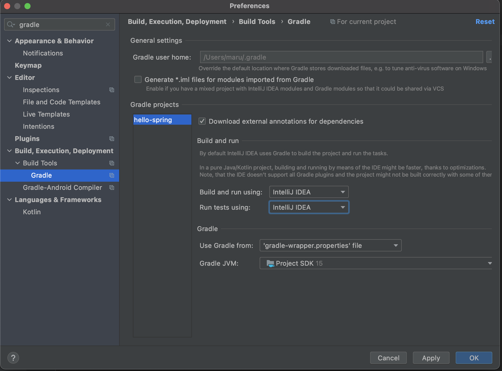
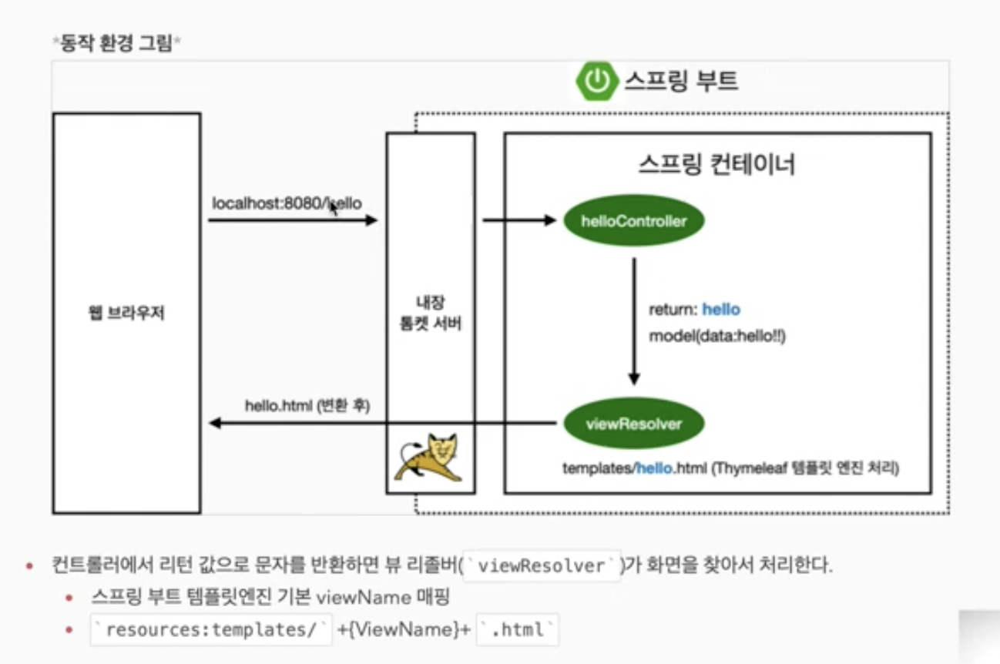
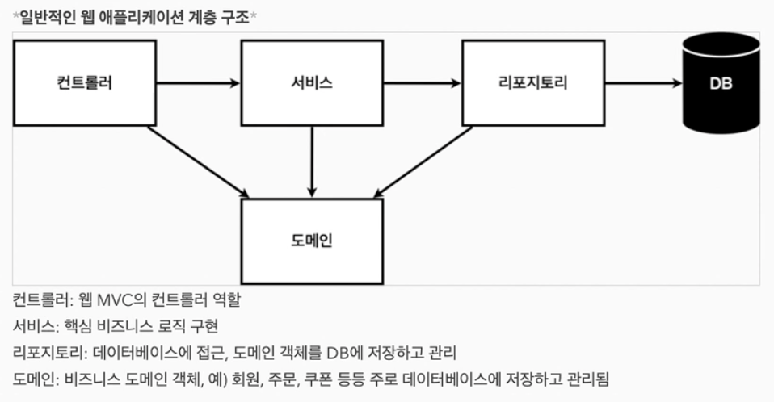
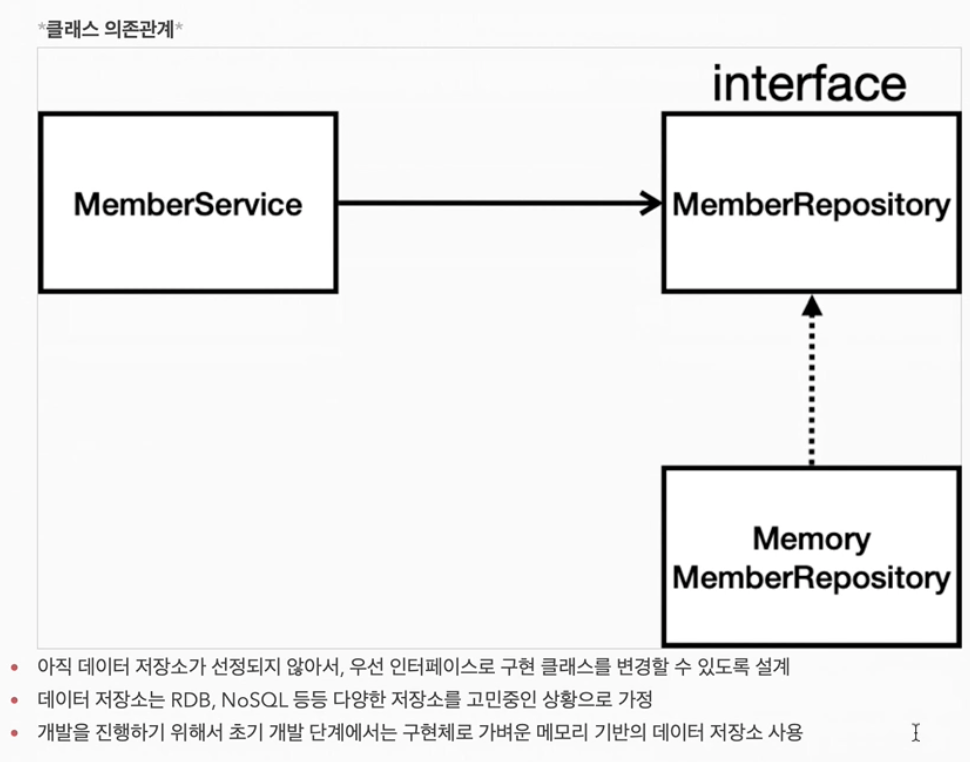

# 1. 프로젝트 환경 설정

## 프로젝트 생성

강의에서 사용하는 java version : Java 11

### 프로젝트 생성 사이트 통해서 프로젝트 만들기

[https://start.spring.io/](https://start.spring.io/) -> 스프링 부트 기반으로 프로젝트를 만들어주는 사이트. 스프링에서 운영함

- 요즘은 의존성 관리 툴로 Maven보다 Gradle을 사용한다.

- 추가 해야 할 의존성
  - Spring Web
  - Thymeleaf

### 프로젝트 살펴보기

- `build.gradle`: 프로젝트의 설정들
  - `mavenCentral()`: 라이브러리를 어디서 다운 받을지를 mavenCentral로 명시 해놓은 부분

Tip: 기본적으로 java를 실행 할 때 gradle을 통해서 실행하는데, 설정에서 IntelliJ Idea로 변경하면 더 빠르게 실행 된다



## 라이브러리 살펴보기

External libraries를 살펴보면 굉장히 많은 라이브러리들이 있다.

starter-web 라이브러리를 받으면 gradle이 starter-web과 관련된 의존성들을 모두 받아온다.

의존성 관계는 오른쪽의 gradle 탭에서 확인 할 수 있다.

실무에서는 `System.out.println`을 사용하지 않는다. 대신 `logging`을 사용해야지 파일 관리나 심각한 에러들을 잘 관리 할 수 있다.

- `slf4j`, `logback`: 스프링에서 표준으로 쓰는 로깅 라이브러리

## View 환경설정

- static에 index.html를 먼저 찾는다.



## 빌드하고 실행하기

```bash
./gradlew build
```

`/build/libs/hello~.jar` 파일을 `java -jar`로 실행 할 수 있음

```bash
# build한거 지우는 커멘드
./gradlew clean
```

# 2. 스프링 웹 개발 기초

## 정적 컨텐츠

기본적으로 `/static` 아래의 파일을 정적 콘텐츠로 제공한다.

## MVC와 템플릿 엔진

## API

- spring boot는 기본적으로 json 형태로 반환하고, 설정에 따라 xml로 반환 할 수 있다.

- 기본 문자처리: `StringHttpMessageConverter`
- 기본 객체처리: `MappingJackson2HttpMessageConverter`

- 클라이언트의 HTTP Accept 헤더에 따라 HttpMessageConverter가 반환 형태를 정해서 반환해준다

# 3. 회원 관리 예제 - 백엔드 개발

## 비즈니스 요구사항 정리





## 회원 도메인과 리포지토리 만들기

## 회원 리포지토리 테스트 케이스 작성

모든 테스트는 순서가 보장이 안된다. 그러므로 테스트가 끝나고 나면 데이터를 클리어해야 한다.

테스트는 서로 의존성이 없도록 설계되어야 한다.

## 회원 서비스 개발

- `option + cmd + v`: return 값을 받아주는 코드를 작성해줌
- `ctrl + t`: refactoring 하는 메뉴를 볼 수 있음. 여기서 extract method를 선택하면 선택한 코드 블록을 함수로 빼줌

## 회원 서비스 테스트

- 테스트는 `given`, `when`, `then` 세 부분으로 작성 된다.

- `cmd + shift + t`: 클래스의 테스트를 만들어주는 단축키

# 3. 스프링 빈과 의존 관계

## 컴포넌트 스캔과 자동 의존관계 설정

```java
import org.springframework.stereotype.Controller;

@Controller
public class MemberController {
}
```

`@Controller` 애노테이션이 붙으면 스프링이 실행 될 때 해당 컨트롤러(예제에서는 MemberController)의 객체가 생성되서 **스프링 컨테이너**(스프링이 실행 될 때 생성 됨)에 담기게 된다. 이걸 빈을 관리 한다고 표현한다.(?)

```java
@Controller
public class MemberController {
    private final MemberService memberService = new MemberService();
}
```

해당 예제 처럼 `new`로 `MemberService` 객체를 생성하는 것은 좋지 않다. 왜냐하면 인스턴스를 여기 저기서 생성하게 되는 것이므로 유지보수 측면에서 좋지 않다.

```java
@Controller
public class MemberController {
    private final MemberService memberService;

    @Autowired
    public MemberController(MemberService memberService) {
        this.memberService = memberService;
    }
}
```

그러므로 생성자 MemberService를 받는게 좋다. `@Autowired` 애노테이션을 사용하면 스프링이 스프링 컨테이너에서 `MemberService` 객체를 찾아서 넣어준다.
스프링 컨테이너에서 찾기 때문에 `MemberService`에 애너테이션을 추가해줘야 한다.

```java
@Service
public class MemberService {
  public MemberService(MemberRepository memberRepository) {
    this.memberRepository = memberRepository;
  }
}
```

`MemberRepository`를 주입 받고 있으므로,
`MemberRepository`도 애노테이션을 달아준다

```java
@Repository
public class MemoryMemberRepository implements MemberRepository{

}
```

**스프링 빈을 등록하는 2가지 방법**

- 컴포넌트 스캔과 자동 의존 관계 설정 => 어노테이션 달아주기
  - `@Component` 어노테이션을 달아주면 된다. 앞선 예제에서 사용한 어노테이션들에는 `@Component`가 달려 있다.
  - `@Component` 등록은 `@SpringBootApplication`가 등록 된 클래스가 속한 패키지 하위에서만 유효 하다. 그 외의 곳에서는 동작하지 않는다.
  - 스프링은 스프링 컨테이너에 스프링 빈을 등록할 때, 기본으로 싱글톤으로 등록한다.
- 자바 코드로 직접 스프링 빈 등록하기
  - 다음 챕터에서 확인

## 자바 코드로 직접 스프링 빈 등록하기

`SpringConfig.java`를 `hello.hellospring`에 만든다

```java
@Configuration
public class SpringConfig {

    @Bean
    public MemberService memberService() {
        return new MemberService(memberRepository());
    }

    @Bean
    public MemberRepository memberRepository() {
        return new MemoryMemberRepository();
    }
}
```

`@Controller`는 어쩔 수 없이 명시 해줘야한다.

_참고_

- 의존관계까 실행중에 동적으로 변하는 경우는 거의 없으므로 생성자 주입을 권장한다.
- 실무에서는 주로 정형화된 컨트롤러, 서비스, 리포지토리 같은 코드는 컴포넌트 스캔을 사용한다. **그리고 정형화 되지 않거나, 상황에 따라 구현 클래스를 변경(현재 예제 처럼 DB가 정해지지 않은 상황)해야 하면 설정(`SpringConfig`)을 통해 스프링 빈으로 등록한다.**

# 4. 회원 관리 예제 - 웹 MVC 개발

## 회원 웹 기능 - 홈 화면 추가

## 회원 웹 기능 - 등록

## 회원 웹 기능 - 조회

# 5. 스프링 DB 접근 기술

## H2 데이터베이스 설치

## 순수 JDBC

## 스프링 통합 테스트

## 스프링 JdbcTemplate

## JPA

JPA를 사용하면

- 객체 중심의 설계로 패러다임을 전환으 할 수 있다.
- JPA를 사용하면 개발 생산성을 크게 높일 수 있다.

```java
@Entity // jpa가 관리해주는 단위
public class Member {

  @Id @GeneratedKey()
}
```

`EntitiyManger`는 Springboot가 만들어서 주입 시켜준다.

jpa는 `@Transactional` 아래에서 돌아가야 하기 때문에, Service 계층에 `@Transactional`을 추가해준다.

```java
`@Transactional`
public class MemberService {
  ...
}
```

## 스프링 데이터 JPA

스프링 데이터 JPA는 JPA를 편리하게 사용하도록 도와주는 도구일 뿐이다. 그러므로 따라서 JPA를 먼저 학습하도록 하자.

interface를 만들고 `JpaRepository<>`와 `MemberRepository` 상속만 받으면 Jpa 내부에서 객체를 생성해서 빈을 등록해준다. 그러면 `MemberRepository` 객체를 주입 받을 수 있다.

이름 컨벤션으로 기능을 제공한다.

```java
@Override
Optional<Member> findByName(String name)
```

# 6. AOP

## AOP가 필요한 상황

- 공통 관심 사항(cross-cutting concern) vs 핵심 관심 사항(core concern)

- 공통 로직와 핵심 로직이 섞여 있으면 유지보수가 힘들다.

## AOP 적용
