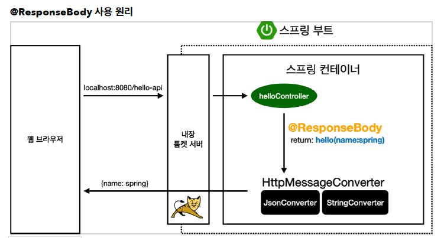

# 스프링 웹 개발 기초

## 정적 컨텐츠

스프링 부트는 정적 컨텐츠를 기본적으로 제공해줍니다.

`resources/static` 경로에 파일을 위치하면 `도메인/파일이름` 으로 접근이 가능합니다.


## MVC와 템플릿 엔진

MVC는 Model, View, Controller입니다.

### Controller

```java
@GetMapping("hello-mvc")
public String helloMvc(@RequestParam("name") String name, Model model) {
  model.addAttribute("name", name);
  return "hello-template";
}
```


### View

``` html
<!doctype html>
<html lang="en" xmlns:th="http://www.thymeleaf.org">
<body>
<p th:text="'hello ' + ${name}">hello! empty</p>
</body>
</html>
```


이 경우 쿼리스트링으로 넘겨온 인자를 받아 화면에 뿌려줍니다.

`http://localhost:8080/hello-mvc?name=spring`


## API

### String을 응답

``` java
@GetMapping("hello-string")
@ResponseBody
public String helloString(@RequestParam("name") String name) {
  return "hello " + name;
}
```


### JSON을 응답

``` java
@GetMapping("hello-api")
@ResponseBody
public Hello helloApi(@RequestParam("name") String name) {
  Hello hello = new Hello();
  hello.setName(name);
  return hello;
}

static class Hello {
  private String name;

  public String getName() {
    return name;
  }

  public void setName(String name){
    this.name = name;
  }
}
```


### @ResponseBody 원리



* return 되는 데이터를 http response body에 직접 넣어주겠다는 의미입니다.
* `viewResolver` 대신 `HttpMessageConverter`가 동작합니다.