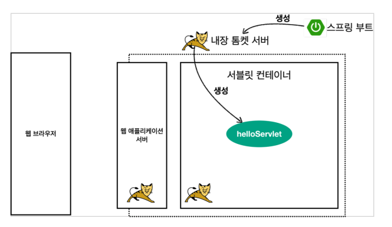

# 02. 서블릿

## 프로젝트 생성

프로젝트 생성

Postman 설치


## Hello 서블릿

>  서블릿은 톰캣 같은 웹 애플리케이션 서버를 직접 설치하고 그 위에 서블릿 코드를 클래스 파일로 빌드해서 올린 다음, 톰캣 서버를 실행하면 되지만 이는 매우 번거롭다.
>
> 스프링 부트는 톰캣 서버를 내장하고 있으므로 톰캣 서버 설치 없이 편리하게 서블릿 코드를 실행할 수 있다.


### @ServletComponentScan

스프링부트는 서블릿을 직접 등록해서 사용할 수 있도록 해당 애노테이션을 지원

``` java
package hello.servlet;
import org.springframework.boot.SpringApplication;
import org.springframework.boot.autoconfigure.SpringBootApplication;
import org.springframework.boot.web.servlet.ServletComponentScan;

@ServletComponentScan //서블릿 자동 등록
@SpringBootApplication
public class ServletApplication {
  public static void main(String[] args) {
    SpringApplication.run(ServletApplication.class, args);
  }
}
```


### 서블릿 등록

`@WebServlet` 

* name : 서블릿 이름
* urlPatterns : URL 매핑

요청이 오면 `service` 실행

``` java
package hello.servlet.basic;

import javax.servlet.ServletException;
import javax.servlet.annotation.WebServlet;
import javax.servlet.http.HttpServlet;
import javax.servlet.http.HttpServletRequest;
import javax.servlet.http.HttpServletResponse;
import java.io.IOException;

@WebServlet(name = "helloServlet", urlPatterns = "/hello")
public class HelloServlet extends HttpServlet {
  
  @Override
  protected void service(HttpServletRequest request, HttpServletResponse
                         response)
    throws ServletException, IOException {
    System.out.println("HelloServlet.service");
    System.out.println("request = " + request);
    System.out.println("response = " + response);
    String username = request.getParameter("username");
    System.out.println("username = " + username);
    response.setContentType("text/plain");
    response.setCharacterEncoding("utf-8");
    response.getWriter().write("hello " + username);
  }
}
```


### 서블릿 컨테이너 동작 방식

* 스프링 부트가 내장 톰켓 서버를 생성
* 내장 톰켓 서버가 서블릿 객체 생성




## HttpServletRequest - 개요

### HttpServletRequest 역할

개발자 대신에 HTTP 요청 메세지를 파싱


### 임시저장소 기능

HTTP 요청이 시작부터 끝날 때 까지 유지되는 임시 저장소 기능

``` java
// 저장
request.setAttribute(name, value);
// 조회
request.getAttribute(name);
```


### 세션 관리 기능

``` 
request.getSession(create: true)
```


## HttpServletRequest - 기본 사용법

### start-line 정보

``` 
request.getMethod() = GET
request.getProtocal() = HTTP/1.1
request.getScheme() = http
request.getRequestURL() = http://localhost:8080/request-header
request.getRequestURI() = /request-header
request.getQueryString() = username=hello
request.isSecure() = false
```


### 헤더 정보

``` java
request.getHeaderNames().asIterator()
 .forEachRemaining(headerName -> System.out.println(headerName + ":
" + request.getHeader(headerName)));
```

```
host: localhost:8080
connection: keep-alive
cache-control: max-age=0
sec-ch-ua: "Chromium";v="88", "Google Chrome";v="88", ";Not A Brand";v="99"
sec-ch-ua-mobile: ?0
upgrade-insecure-requests: 1
user-agent: Mozilla/5.0 (Macintosh; Intel Mac OS X 11_2_0) AppleWebKit/537.36
(KHTML, like Gecko) Chrome/88.0.4324.150 Safari/537.36
accept: text/html,application/xhtml+xml,application/xml;q=0.9,image/avif,image/
webp,image/apng,*/*;q=0.8,application/signed-exchange;v=b3;q=0.9
sec-fetch-site: none
sec-fetch-mode: navigate
sec-fetch-user: ?1
sec-fetch-dest: document
accept-encoding: gzip, deflate, br
accept-language: ko,en-US;q=0.9,en;q=0.8,ko-KR;q=0.7
```


### Header 편리한 조회

``` java
System.out.println("[Host 편의 조회]");
System.out.println("request.getServerName() = " +
                   request.getServerName()); //Host 헤더
System.out.println("request.getServerPort() = " +
                   request.getServerPort()); //Host 헤더
System.out.println();
System.out.println("[Accept-Language 편의 조회]");
request.getLocales().asIterator()
  .forEachRemaining(locale -> System.out.println("locale = " +
                                                 locale));
System.out.println("request.getLocale() = " + request.getLocale());
System.out.println();
System.out.println("[cookie 편의 조회]");
if (request.getCookies() != null) {
  for (Cookie cookie : request.getCookies()) {
    System.out.println(cookie.getName() + ": " + cookie.getValue());
  }
}
System.out.println();
System.out.println("[Content 편의 조회]");
System.out.println("request.getContentType() = " +
                   request.getContentType());
System.out.println("request.getContentLength() = " +
                   request.getContentLength());
System.out.println("request.getCharacterEncoding() = " +
                   request.getCharacterEncoding());
```

```
[Host 편의 조회]
request.getServerName() = localhost
request.getServerPort() = 8080

[Accept-Language 편의 조회]
locale = ko
locale = en_US
locale = en
locale = ko_KR
request.getLocale() = ko
[cookie 편의 조회]

[Content 편의 조회]
request.getContentType() = null
request.getContentLength() = -1
request.getCharacterEncoding() = UTF-8
```


### 기타 정보

``` java
System.out.println("[Remote 정보]");
System.out.println("request.getRemoteHost() = " +
                   request.getRemoteHost()); //
System.out.println("request.getRemoteAddr() = " +
                   request.getRemoteAddr()); //
System.out.println("request.getRemotePort() = " +
                   request.getRemotePort()); //
System.out.println();
System.out.println("[Local 정보]");
System.out.println("request.getLocalName() = " +
                   request.getLocalName()); //
System.out.println("request.getLocalAddr() = " +
                   request.getLocalAddr()); //
System.out.println("request.getLocalPort() = " +
                   request.getLocalPort()); //
```

``` 
[Remote 정보]
request.getRemoteHost() = 0:0:0:0:0:0:0:1
request.getRemoteAddr() = 0:0:0:0:0:0:0:1
request.getRemotePort() = 54305

[Local 정보]
request.getLocalName() = localhost
request.getLocalAddr() = 0:0:0:0:0:0:0:1
request.getLocalPort() = 8080
```


## HTTP 요청 데이터 - 개요

HTTP 요청 메세지를 통해 클라이언트에서 서버로 데이터를 전달하는 방법은 3가지

* GET 쿼리 파라미터

* POST HTML Form

  * content-type: application/x-www-form-urlencoded 

  * 메시지 바디에 쿼리 파리미터 형식으로 전달 

    ```username=hello&age=20
    username=hello&age=20
    ```

* HTTP message body


## HTTP 요청 데이터 - GET 쿼리 파라미터

### 전체 파라미터 조회

url : http://localhost:8080/request-param?username=hello&age=20

``` java
request.getParameterNames().asIterator()
  .forEachRemaining(paramName -> System.out.println(paramName + "=" + request.getParameter(paramName)));
```

```
username=hello
age=20
```


### 단일 파라미터 조회

url : http://localhost:8080/request-param?username=hello&age=20

``` java
String username = request.getParameter("username");
System.out.println("request.getParameter(username) = " + username);
String age = request.getParameter("age");
System.out.println("request.getParameter(age) = " + age);
```

``` java
request.getParameter(username) = hello
request.getParameter(age) = 20
```


### 동일 파라미터 전송

url : http://localhost:8080/request-param?username=hello&username=kim


``` java
String[] usernames = request.getParameterValues("username");
for (String name : usernames) {
  System.out.println("username=" + name);
}
```

``` 
username=hello
username=kim
```


## HTTP 요청 데이터 - POST HTML Form

* content-type: `application/x-www-form-urlencoded`

* 메시지 바디에 쿼리 파리미터 형식으로 데이터를 전달한다. 

  ``` 
  username=hello&age=20
  ```


`application/x-www-form-urlencoded` 형식은 앞서 GET에서 살펴본 쿼리 파라미터 형식과 같다. 따라서 쿼리 파라미터 조회 메서드를 그대로 사용하면 된다

``` java
request.getParameter()
```


## HTTP 요청 데이터 - API 메시지 바디 - 단순 텍스트

content-type: text/plain

``` java
ServletInputStream inputStream = request.getInputStream();
String messageBody = StreamUtils.copyToString(inputStream, StandardCharsets.UTF_8);
System.out.println("messageBody = " + messageBody);
```


## HTTP 요청 데이터 - API 메시지 바디 - 단순 JSON

content-type: application/json

``` java
private ObjectMapper objectMapper = new ObjectMapper();

@Override
protected void service(HttpServletRequest request, HttpServletResponse response) throws ServletException, IOException {
  ServletInputStream inputStream = request.getInputStream();
  String messageBody = StreamUtils.copyToString(inputStream, StandardCharsets.UTF_8);
  System.out.println("messageBody = " + messageBody);
  HelloData helloData = objectMapper.readValue(messageBody, HelloData.class);
  System.out.println("helloData.username = " + helloData.getUsername());
  System.out.println("helloData.age = " + helloData.getAge());
  
}
```


## HttpServletResponse - 기본 사용법

### status

``` java
response.setStatus(HttpServletResponse.SC_OK);
```


### header

``` java
response.setHeader("Content-Type", "text/plain;charset=utf-8");
 response.setHeader("Cache-Control", "no-cache, no-store, mustrevalidate");
 response.setHeader("Pragma", "no-cache");
 response.setHeader("my-header","hello"); // 개발자 임의 헤더
```


### content

``` java
//Content-Type: text/plain;charset=utf-8
//Content-Length: 2
//response.setHeader("Content-Type", "text/plain;charset=utf-8");
response.setContentType("text/plain");
response.setCharacterEncoding("utf-8");
//response.setContentLength(2); //(생략시 자동 생성)
```


### 쿠키

``` java
Cookie cookie = new Cookie("myCookie", "good");
cookie.setMaxAge(600); //600초
response.addCookie(cookie);
```


### redirect

``` java
//Status Code 302
//Location: /basic/hello-form.html
//response.setStatus(HttpServletResponse.SC_FOUND); //302
//response.setHeader("Location", "/basic/hello-form.html");
response.sendRedirect("/basic/hello-form.html");
```


## HTTP 응답 데이터 - 단순 텍스트, HTML

### 단순 텍스트 응답

``` java
writer.println("ok");
```


### HTML 응답

``` java
response.setContentType("text/html");
response.setCharacterEncoding("utf-8");

PrintWriter writer = response.getWriter();
writer.println("<html>");
writer.println("<body>");
writer.println(" <div>안녕?</div>");
writer.println("</body>");
writer.println("</html>");
```


## HTTP 응답 데이터 - API JSON

``` java
response.setHeader("content-type", "application/json");
response.setCharacterEncoding("utf-8");
HelloData data = new HelloData();
data.setUsername("kim");
data.setAge(20);
//{"username":"kim","age":20}
String result = objectMapper.writeValueAsString(data);
response.getWriter().write(result);
```


