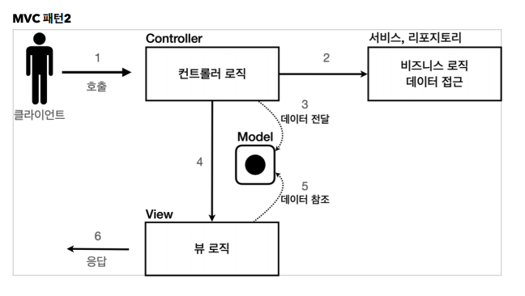

# 03. 서블릿, JSP, MVC 패턴

## 회원 관리 웹 애플리케이션 요구사항

* 회원 저장
* 회원 조회


## 서블릿으로 회원 관리 웹 애플리케이션 만들기

## JSP로 회원 관리 웹 애플리케이션 만들기

* JSP문서라는 것을 상단에 명시

  ``` jsp
  <%@ page contentType="text/html;charset=UTF-8" language="java" %>
  ```

* import 문

  ``` jsp
  <%@ page import="hello.servlet.domain.member.MemberRepository" %>
  ```

* 자바 코드 입력

  ``` JSP
  <% ~~ %>
  ```

* 자바 코드 출력

  ``` jsp
  <%= ~~ %>
  ```


JAVA 코드, 데이터를 조회하는 리포지토리 등등 다양한 코드가 모두 JSP에 있기 때문에 유지보수 측면에서 좋지않다.


## MVC 패턴 - 개요

### 변경의 라이프 사이클

사실 이게 정말 중요한데, 진짜 문제는 둘 사이에 변경의 라이프 사이클이 다르다는 점이다. 예를 들어서 UI 를 일부 수정하는 일과 비즈니스 로직을 수정하는 일은 각각 다르게 발생할 가능성이 매우 높고 대부분 서로에게 영향을 주지 않는다. 이렇게 변경의 라이프 사이클이 다른 부분을 하나의 코드로 관리하는 것은 유지보수하기 좋지 않다. (물론 UI가 많이 변하면 함께 변경될 가능성도 있다.)

### MVC 패턴



## MVC 패턴 - 적용

### 구조

컨트롤러 : 스블릿

뷰 : JSP

모델 :  HttpServletRequest 객체


### /WEB-INF

이 경로안에 JSP가 있으면 외부에서 직접 JSP를 호출할 수 없다. 

우리가 기대하는 것은 항상 컨트롤러를 통해서 JSP를 호출하는 것이다.


### redirect vs forward

리다이렉트는 실제 클라이언트(웹 브라우저)에 응답이 나갔다가, 클라이언트가 redirect 경로로 다시 요청한다. 따라서 클라이언트가 인지할 수 있고, URL 경로도 실제로 변경된다. 

반면에 포워드는 서버 내부에서 일어나는 호출이기 때문에 클라이언트가 전혀 인지하지 못한다.


## MVC 패턴 - 한계

### MVC 컨트롤러의 단점

* 포워드 중복

  ``` java
  RequestDispatcher dispatcher = request.getRequestDispatcher(viewPath);
  dispatcher.forward(request, response);
  ```

  

* ViewPath 중복

  `/WEB-INF/views/` 부분과 `jsp` 부분은 중복해서 계속 들어감

  ``` java
  String viewPath = "/WEB-INF/views/new-form.jsp";
  ```

  

* 사용하지 않는 코드

  ``` java
  HttpServletRequest request, HttpServletResponse response
  ```

  

* 공통 처리가 어렵다

  기능이 복잡해질 수 록 컨트롤러에서 공통으로 처리해야 하는 부분이 점점 더 많이 증가할 것이다. 단순히 공통 기능을 메서드로 뽑으면 될 것 같지만, 결과적으로 해당 메서드를 항상 호출해야 하고 호출하는 것 자체도 중복이다.


### 프론트 컨트롤러 패턴

컨트롤러 호출 전에 먼저 공통 기능을 처리하는 패턴

스프링 MVC의 핵심도 바로 이 프론트 컨트롤러